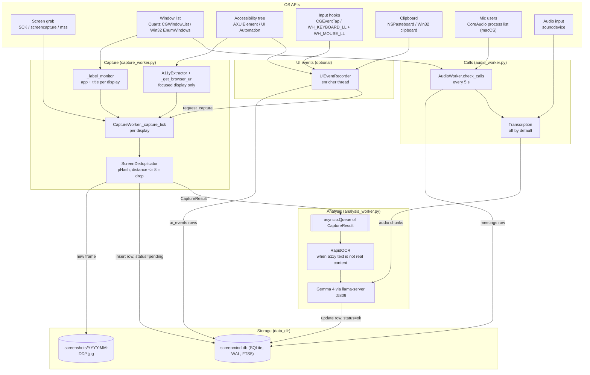
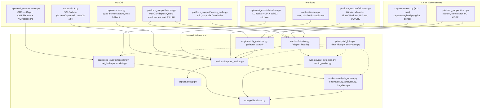

# Capture architecture

What ScreenMind captures on macOS and Windows, how, and where it ends up. Linux gets a short side column.

This file is the source of truth. It was written from the code on `custom` at `482c275` (2026-10-07) and updated for the strip-down to action collection ([plan](../plans/strip-to-actions.md)), DB schema v11. Where the code and a backlog file disagree, this file follows the code. See [Code vs backlog](#9-code-vs-backlog).

A rendered version with the same content is published as an Artifact: https://claude.ai/artifact/DUVgVLd84bMqUUNciuf7vA (private to the owner). Its source is [`capture.html`](capture.html) next to this file.

This file says what the code is meant to collect. What a real run actually collected on each machine is in [`docs/status/`](../status/README.md): one file per machine, written by the end-to-end check `scripts/e2e_collect.py`. See [`summary.md`](../status/summary.md) for all machines side by side.

Contents:

1. [Data flow](#1-data-flow)
2. [Matrix: data point by OS](#2-matrix-data-point-by-os)
3. [Components per OS](#3-components-per-os)
4. [Data points in detail](#4-data-points-in-detail)
5. [Storage](#5-storage)
6. [Permissions](#6-permissions)
7. [Privacy filters](#7-privacy-filters)
8. [Gaps](#8-gaps)
9. [Code vs backlog](#9-code-vs-backlog)
10. [How to update](#10-how-to-update)

## 1. Data flow

Three workers run side by side. `CaptureWorker` takes screenshots and reads window info, a11y text and the URL at the moment of the grab. `AnalysisWorker` picks frames from a queue, runs OCR and Gemma, and writes the results. `AudioWorker` watches for calls on its own thread. `UiEventRecorder` records clicks and app switches by default; it can be turned off.



The order inside one tick, from `CaptureWorker._capture_monitor()`:

1. Read the focused app and window title (before the grab).
2. Grab the display. Save it as a JPEG.
3. pHash dedup. A duplicate is deleted from disk and nothing else happens.
4. Run the window title through the sensitive-data filter.
5. On the focused display only: read a11y text and the browser URL right after the grab (`_read_focused()`). If the focused title is no longer the one read in step 1, drop both: they would describe another window than the image.
6. Insert an `activities` row (`status='pending'`) so the timeline shows it at once.
7. Link pending UI events to this row (`activities.user_actions`). This waits at most 5 s (`LINK_UI_EVENTS_TIMEOUT_S`); a stuck recorder means frames are saved without actions.
8. Put a `CaptureResult` on the queue. a11y text and the URL live in this object until analysis writes them (or `mark_skipped()` does, see 4.9).

## 2. Matrix: data point by OS

Gap ids (G1, G2...) point to [section 8](#8-gaps).

| Data point | What we collect | macOS | Windows | Linux (side column) | Stored in | Gaps |
|---|---|---|---|---|---|---|
| Screenshot | One JPEG per display per changed tick | ScreenCaptureKit `SCScreenshotManager` (pyobjc), then `screencapture -x` CLI, then `mss` (CoreGraphics) | `mss` (GDI BitBlt) | X11: `mss`. Wayland: `grim`, then XDG Desktop Portal | `screenshots/YYYY-MM-DD/HH-MM-SS_mmm[_mN].jpg`, `activities.screenshot_path` | G1, G3 |
| Change detection | pHash per display | `imagehash.phash` | same | same | not stored (in memory) | G4 |
| App name | Owner of the top window per display | Quartz `CGWindowListCopyWindowInfo`, `kCGWindowOwnerName` | `EnumWindows` + `QueryFullProcessImageNameW` (exe name, UWP child process) | `xdotool` + `/proc`, or compositor IPC on Wayland | `activities.detected_app` | G5, G6 |
| Window title | Title of the top window per display | `kCGWindowName`; if it is only the app name, `AXTitle` of the window's `AXWebArea` (Electron) | `GetWindowTextW`; if it is only the app name, the name of the window's UIA `Document` | `xdotool getwindowname` / `xprop`, compositor IPC | `activities.window_title` (sensitive-filtered) | G5 |
| Visible windows | All app windows, all displays, front to back | `list_visible_windows()` (Quartz, layer 0) | `list_visible_windows()` (`EnumWindows`, filters) | focused window only | not stored; used for call detection | G29 |
| Screen text (a11y) | Text of the focused window | `AXUIElement` walk, `_walk_ax_tree` | UI Automation: `_walk_tree` for native controls, `web_text` over a cached tree for web Documents (`uiautomation`) | AT-SPI (`pyatspi`) | inside `activities.ocr_text` | G7, G8, G12 |
| Browser URL | Page URL of the focused browser window | `AXURL` of the one top-level `AXWebArea` (`_ax_page_url`) | UIA `Document` value (`pick_page_document`) | none | `activities.active_url`, `ui_events.url`, `meetings.url` (sanitized) | G8, G9, G16 |
| OCR text | Text from pixels | RapidOCR (ONNX Runtime, CPU) | same | same | `activities.ocr_text`, `ocr_boxes`, `organized_text` | G14 |
| UI events | Clicks, typed text, app switches, tab/page changes, clipboard | `CGEventTap` (listen-only) + `AXUIElement` + `NSPasteboard` | `WH_KEYBOARD_LL` / `WH_MOUSE_LL` hooks + UIA + Win32 clipboard | none | `ui_events`, `activities.user_actions` | G21, G22, G25, G27, G31 |
| Call start/end | App, title, room URL, duration | Window rules + CoreAudio "is running input" per process | Window rules only (no mic info) | Window rules on the focused window only | `meetings` | G16, G17, G27, G40, G41 |
| Call audio | Mic + system audio, transcript, summary | `sounddevice` mic; system audio only with a virtual loopback device | `sounddevice` mic + a device named "loopback" / "Stereo Mix" | `sounddevice` mic | `meetings.transcript`, `meetings.summary` | G18 |
| Analysis | Category, summary, scene, layout | Gemma 4 E2B (llama-server) | same | same | `activities.app_name`, `category`, `summary`, `details`, `visible_text`, `mood`, `confidence`, `scene_description` | G15 |

## 3. Components per OS



`platform_support.get_adapter()` picks the adapter from `sys.platform`. `capture.ui_events.create_backend()` picks the UI event backend the same way and returns `None` on Linux.

## 4. Data points in detail

### 4.1 Screenshots

**What:** one RGB image per display, saved as JPEG (`SCREENSHOT_QUALITY`, default 70). The cursor is not included.

**macOS order** (`ScreenCapture._grab_with_fallback()`):

1. **ScreenCaptureKit**, `capture/sck.py`. `SCShareableContent` lists the displays. It is refreshed every 60 s, so a replugged display gets a fresh `SCDisplay`. `SCScreenshotManager.captureImageWithFilter_configuration_completionHandler_` grabs one display at native pixel size in BGRA. The async handler is awaited with a 3 s timeout. One timeout, or three handler errors in a row, start a cool-down: grabs use the `screencapture` tool for 5 min. Then one probe goes out: a screenshot request that the capture tick does not wait for. The next tick reads its answer. An answer within 3 s brings SCK back. A failed probe doubles the wait (10, 20, 40, then every 60 min). The back-off starts over once SCK has worked for 30 min after coming back. If SCK never gave a frame in the process (a Claude-started process, G1), it stops for good after 2 failed probes. At most one SCK request is waited for at a time. A request that never answers costs a few KB and no thread (200 of them: about 4 MB). The log says `ScreenCaptureKit ... next try in N min`, `ScreenCaptureKit answered a probe ...; using it again`, and `Screen grab backend: <name>` on every switch. `/api/status` shows the state under `capture.grab`: `backend`, and `sck.state` (`on`, `cooldown`, `off`), `sck.next_retry`, `sck.probing`, `sck.lost_requests`.
2. **`screencapture -x -t png -R x,y,w,h`**, the macOS CLI, about 0.2 s per display. Used while SCK cools down or fails, or for good after one mss grab took over 5 s.
3. **mss**, which uses `CGWindowListCreateImage`. It is deprecated and can hang 30 s.

SCK needs `pyobjc-framework-ScreenCaptureKit` (a macOS dependency in `pyproject.toml`) and macOS 14. Without them `sck.available()` is False and the log says "ScreenCaptureKit not available; using mss".

**Windows:** mss only (GDI). The active monitor comes from `MonitorFromWindow` + `GetMonitorInfoW`. mss makes the process per-monitor DPI aware, so window rects and monitors are both in physical pixels.

**Linux:** mss on X11. On Wayland, `WaylandScreenCapture` tries `grim` (wlroots compositors), then the XDG Desktop Portal (GNOME, KDE).

**Displays.** `CAPTURE_ALL_MONITORS` (default on) grabs every display each tick, one row per display. Off: one display, the primary or, with `CAPTURE_ACTIVE_MONITOR`, the one with the focused window.

**Timing** (`CaptureWorker.run()`). The loop wakes every 0.5 s and acts about every 5 s:

- Active: a "change" grab if 10 s passed since the last saved frame. A "periodic" grab at `CAPTURE_INTERVAL` (default 40 s, range 10-120).
- Idle: after 3 ticks in a row with no new frame, only the periodic grab.
- Event-driven, only with UI events on: `request_capture()` after an app switch (1.0 s delay), click (1.5 s), Enter in a text field (0.5 s) or a page change (1.0 s). Requests within 3 s merge into one grab, and grabs are at least 3 s apart.

Every grab, including the periodic one, goes through dedup. A screen that does not change gets no new row. See G4.

**Skips.** A display whose top app is in `BLOCKED_APPS` is not grabbed (exact name match, lowercase). `AUTO_PAUSE_HEAVY_APPS` skips the whole tick when the focused app name contains a `HEAVY_APPS` substring (games, video editors).

### 4.2 Dedup

`capture/dedup.py`. One `ScreenDeduplicator` per display. It compares the `imagehash.phash` of the new frame with the last kept one. Hamming distance 8 or less is a duplicate: the JPEG is deleted and no row is written.

The analysis worker has a second, per-app cache keyed by `(app, title[:100])`:

- distance 3 or less: "identical", copy the last analysis, skip OCR and Gemma;
- 4-10 and younger than 240 s (chat apps) or 420 s (others): "minor", run OCR, reuse Gemma's analysis;
- more: "full".

### 4.3 Window and app info

**macOS** (`MacOSAdapter`):

- `_visible_windows()` calls `CGWindowListCopyWindowInfo(kCGWindowListOptionOnScreenOnly | kCGWindowListExcludeDesktopElements)`. It keeps layer-0 windows at least 50x50. Windows on other Spaces and minimized ones are not listed. `kCGWindowName` is empty without Screen Recording permission.
- Not `NSWorkspace.frontmostApplication()`: it goes stale in a process without an `NSRunLoop`.
- `get_top_window_in(x, y, w, h)` returns the first window whose center is on that display. `can_find_top_window` is True, so "no window" means an empty display.
- `_best_title()`: when the Quartz title is empty or equals the app name (Electron apps: Claude, Slack), it uses `AXTitle` of the first `AXWebArea` in that exact window (`_ax_window_at()` matches by bounds, 4 pt tolerance). It first sets `AXManualAccessibility` on the app (`enable_full_a11y_tree()`).
- `trusts_os_app_name` is True. The owner name ("Google Chrome") is used before title parsing.

**Windows** (`WindowsAdapter`):

- `_app_windows()` walks `EnumWindows` from the top of the z-order. `is_app_window()` drops hidden, minimized, DWM-cloaked (other virtual desktops), tool, click-through, no-activate and always-on-top windows, shell classes (taskbar, desktop), untitled and tiny ones.
- App name is the exe name without extension (`process_name()`, `PROCESS_QUERY_LIMITED_INFORMATION`). For UWP apps inside `ApplicationFrameHost`, the child's process.
- `_best_title()`: when the title is only the app name, the name of the window's top on-screen UIA `Document`.
- `trusts_os_app_name` is False: "chrome" is less useful than the title.

**Linux:** `xdotool` on X11, compositor IPC (sway, Hyprland and others) on Wayland. No `get_top_window_in`, no window list.

### 4.4 Accessibility text

Read by `A11yExtractor.extract_text()` → `adapter().extract_a11y_text()`, at grab time, for the focused display only. Other displays get OCR only (G7).

**macOS** (`MacOSAdapter.extract_a11y_text()` and `_walk_ax_tree()`):

- Root: `AXFocusedWindow` of the front app. For browsers, only the page areas from `_ax_page_areas()`: top-level `AXWebArea`s that are not `devtools:`, `chrome-extension:`, `moz-extension:` or `safari-web-extension:`. The tab strip and the address bar are not read.
- Skipped roles: `AXMenuBar`, `AXMenuBarItem`, `AXMenu`, `AXMenuItem`. Skipped subroles: `AXLandmarkNavigation`, `AXLandmarkComplementary` (site nav, sidebars). Password fields (`AXSecureTextField`) are never read.
- Reads `AXTitle` and `AXValue`. A value over 4,000 chars (`_A11Y_VISIBLE_ONLY_CHARS`) is replaced by its visible part (`AXVisibleCharacterRange` + `AXStringForRange`), for example Terminal without scrollback.
- Drops lines seen before, and a line that is the start or end of the previous one.
- Limits: depth 8, reset to 0 at each `AXWebArea` with limit 45; 4,000 nodes; 300,000 chars (`_A11Y_MAX_TOTAL_CHARS`). AX timeout 1 s per call for the whole process.
- Result under 21 chars counts as nothing.

**Windows** (`WindowsAdapter.extract_a11y_text()` → `_extract_uiautomation()`):

- Browsers (`_BROWSER_EXES`): only the on-screen page Documents from `page_documents()`. Not DevTools, extension panels or Chrome's own side panels (`.top-chrome`). Split view gives two pages. The tab strip, toolbar and address bar are not read. No page Document means no a11y text, and analysis uses OCR.
- Other apps: the native walk `_walk_tree()` from the window (depth 8, 500 lines). It skips `MenuBarControl`, `MenuControl`, `MenuItemControl`, `TitleBarControl`, `ScrollBarControl`, and native chrome by type: `ButtonControl`, `SplitButtonControl`, `ToolBarControl`, `StatusBarControl`, `TabItemControl`. Then its web Documents (Electron apps), read whole.
- Web Documents (`is_web_document()`: read-only, value is a URL) are fetched in one UIA cache request (`_cached_tree()`, up to 20,000 nodes, depth 200) and read by `web_text()`: on-screen elements only, skips `navigation` and `complementary` ARIA landmarks, menus, scroll bars and passwords. Document values (URLs) and link targets are not read.
- Native controls: `Name` and the value. Editable `Edit` and `Document` controls give only their visible lines (`TextPattern.GetVisibleRanges`). Other values are cut to their last 4,000 chars. Password fields (`IsPassword`) are never read.
- Drops lines seen before, and prefix/suffix repeats (same `_repeats()` rule as macOS). Total cap 300,000 chars. UIA timeouts 1 s (`set_uia_timeouts()` swaps in `CUIAutomation8`). A huge page can outlast the timeout; then OCR covers it.
- Fallback without `uiautomation`: `EnumChildWindows` + `GetWindowTextW`, up to 300 strings.

**Linux:** AT-SPI via `pyatspi`.

**How analysis uses it** (`_a11y_is_content()`): a11y text counts as real content when it has at least 200 chars after removing the title and the app name, and is not mostly repeats. On macOS and Linux it also drops English chrome markers and menu-word lines. Windows skips that check, because its walker already left chrome out by element type, in any UI language. Then it replaces OCR. If it is chrome only, OCR runs and a11y text up to 500 chars is put in front of the OCR text. The path (`a11y`, `ocr`, `a11y+ocr`, plus `+layout`) is only logged (`[text: N chars via ...]`). `analysis_method` stores the analysis tier instead (`full:fast`, `cache:minor`, `cache:identical`, `backfill:...`, `skipped`, `rule:empty_screen`). Only OCR writes `ocr_boxes`, so a row with `ocr_boxes` set went through OCR.

The a11y text has no column of its own. It ends up in `activities.ocr_text` (G12).

### 4.5 Browser URL

`capture_worker._get_browser_url()` → `adapter().get_browser_url()` → `privacy.url_filter.sanitize_url()`. Focused display only.

**macOS:** only when the front app is in `BROWSER_APPS` (Chrome, Safari, Arc, Brave, Edge, Vivaldi, Opera, Orion, Firefox, Zen and variants). `_ax_page_url()` takes the `AXURL` of the page areas from `_ax_page_areas()`. Exactly one http(s) URL must remain, else `None`. Iframes are not visited.

Known holes: Chrome ignores `AXManualAccessibility`. After a reboot, with no other accessibility client running, Chrome has no `AXWebArea` at all: no URL and no a11y page text (G8). Firefox is untested (G9).

**Windows:** only when the foreground exe is in `_BROWSER_EXES` (chrome, msedge, firefox, brave, vivaldi, opera, arc and others). `_window_documents()` finds every UIA `Document` in the window. `pick_page_document()` keeps top-level, on-screen Documents that are not DevTools, extensions or Chrome's own side panels (`page_documents()`). Exactly one must remain with an `http`, `https` or `file:///` URL. Chrome and Firefox build the tree lazily, so the first query after a window opens can be empty. `file:///` passes here but `sanitize_url()` drops it.

**Per window:** `get_window_url(pid, bounds)` reads the URL of a browser window that is not in front. macOS only; it is used for call room URLs (G16).

**Not used:** URLs found in OCR text. `_extract_all_urls()` still finds them and passes them to Gemma as a hint, but `active_url` is only the browser's own URL.

**Linux:** none.

### 4.6 OCR

`engine/ocr.py`, `OCRExtractor`. RapidOCR on ONNX Runtime, CPU only. EasyOCR is gone since `4cb9030`.

- Detection: PP-OCRv6 tiny. Recognition: PP-OCRv5 mobile, one model per frame.
- `OCR_LANGUAGES` (default `en`) picks the recognizer with `_rec_model()`. English only: `en`. Any other code: its script model. Mixed scripts: a Cyrillic model wins, because it also reads Latin. So one script per frame (G14).
- Readings under 0.5 confidence are dropped. With a Cyrillic model, `_fix_lookalikes()` makes each mixed word one script.
- Models (~15 MB) download to `~/.screenmind/models/ocr` on first use.
- onnxruntime options (`_session_options()`): memory pattern and memory arena off, `OCR_THREADS` threads (default 2). RapidOCR has no setting for the memory pattern, so `_tune_sessions()` loads its models again with these options. Same text as the defaults, with less memory and about 40% less CPU per frame. Each frame takes about 45% longer.
- Runs in the analysis worker, not at grab time. Skipped when a11y text is real content, and on "identical" cache hits.
- Output: text, plus boxes as JSON (`ocr_boxes`). `layout_analyzer.organize_ocr_text()` groups boxes into regions (`organized_text`), from Gemma's layout in `merged` mode or from OCR clustering otherwise.

### 4.7 UI events

`screenmind/capture/ui_events/`. On by default (`UI_EVENTS_ENABLED=true`) with `UI_EVENTS_TYPES=click,app_switch`. Typed text (`text`), `clipboard` and `window_focus` are opt-in, because text and clipboard can hold private content (G31). A `settings.json` saved before this default keeps its own value.

```
OS hook thread -> queue.SimpleQueue -> enricher thread -> ui_events table
                                              +-> CaptureWorker.request_capture()
```

**macOS backend** (`MacOSUiEventBackend`):

- Input: `CGEventTapCreate(kCGSessionEventTap, kCGTailAppendEventTap, kCGEventTapOptionListenOnly)` for left/right mouse down and key down. Without Input Monitoring that call returns NULL, so it retries with mouse events only: clicks still work, typing and shortcuts don't (`tap_stats()["keys_tapped"]` is false). It runs a `CFRunLoop` on its own thread. If macOS disables the tap for a slow callback, the callback turns it back on and counts it. Exceptions in the callback are counted, not raised (`tap_stats()`).
- Characters: `CGEventKeyboardGetUnicodeString`. Cmd or Ctrl held means a shortcut, not text.
- Elements: `AXUIElementCopyElementAtPosition` for clicks, the system-wide `AXFocusedUIElement` for typing. A click on a label walks up to 3 parents to the control. AX timeout 0.25 s.
- Clipboard: `NSPasteboard.changeCount()` polled every 1 s, and 0.3 s after Cmd+C / Cmd+X. Skips pasteboards marked `org.nspasteboard.ConcealedType`, `TransientType` or `AutoGeneratedType`.

**Windows backend** (`WindowsUiEventBackend`):

- Input: `SetWindowsHookExW(WH_KEYBOARD_LL)` and `WH_MOUSE_LL` on one thread with a `GetMessageW` loop. Injected events are skipped. A 10 s watchdog re-installs a hook that went silent while input arrived.
- Characters: `ToUnicodeEx` with flag `0x4`, plus its own dead-key composition.
- Elements: UIA through `uiautomation`. Roles are normalized (`EditControl` → `Edit`).
- Clipboard: `GetClipboardSequenceNumber`. Skips data marked `ExcludeClipboardContentFromMonitorProcessing`, `CanIncludeInClipboardHistory=0` or `CanUploadToCloudClipboard=0`.
- `x`/`y` are physical pixels on Windows and points on macOS.

**Shared recorder** (`UiEventRecorder`):

- Front window polled every 0.5 s (`adapter().get_front_window()`). A new pid or app name is an `app_switch`. A title change with a new browser URL is a `window_focus`, even when `window_focus` is not in `UI_EVENTS_TYPES`.
- Typing is kept only when the focused element is a text input (`TEXT_INPUT_ROLES`) and is not read-only. `TextBuffer` groups keys per field. Enter, Tab, arrows, Escape, a click, an app switch or 2 s idle end a chunk. Max 500 chars.
- Password fields store `[password field]`, never the text.
- Nothing is recorded while capture is paused or the app is in `BLOCKED_APPS`. These skips are counted (`status()["skipped"]`).
- Console logs, so a silent failure is visible: "UI events are off" at startup when disabled; the enabled types on start; a missing Accessibility or Input Monitoring grant; "first input event received"; a warning if no click or key arrives in the first 2 min; events lost in the hook callback; a hook that stopped; and every 10 min a summary of input, stored rows per type and skips.
- Every text field (names, values, typed text, clipboard up to 1,000 chars, window titles) goes through the sensitive-data filter in one place before it is queued for the DB. A label typed before a pause ("pwd -") is checked together with the next chunk. URLs go through `sanitize_url()`.
- Rows are written in batches every 2 s. Backend calls run without the recorder lock, so a hung UIA or clipboard call cannot block capture. `flush_for_capture()` waits at most 2 s for the lock.
- At each saved frame, `attach_ui_events()` links all unlinked events up to that moment to the new row. `format_user_actions()` turns them into at most 10 bullet lines (1,200 chars) in `activities.user_actions`. These lines go into the Gemma prompt. With several displays, all events go to the first frame saved in the tick (G21).

### 4.8 Calls and meetings

`workers/audio_worker.py` and `workers/call_detection.py`. Calls are tracked always. Transcription is off by default (`MEETING_TRANSCRIPTION=false`).

**Detection**, own thread, every 5 s, also while capture is paused:

- Input: `list_visible_windows()` (all displays, front to back) and `get_mic_apps()`.
- `get_mic_apps()` on macOS (`platform_support/macos_audio.py`): CoreAudio `kAudioHardwarePropertyProcessObjectList`, then per process `kAudioProcessPropertyIsRunningInput` and the pid. Each pid maps to its outermost `.app` bundle name ("Slack Helper" → "Slack"). This is the signal behind the orange mic dot. It opens no audio device and needs no mic permission. macOS 14+. Windows and Linux return `None`.
- `match_call()` rules for `MEETING_APPS` (default `zoom,teams,meet,webex,slack,discord`):
  - Meet: a browser window titled "Meet - ...".
  - Zoom: title "Zoom Meeting/Webinar", or Zoom on the mic.
  - Teams / Webex: app in owner or title, plus "meeting"/"call" in the title, or on the mic.
  - Slack: "huddle" in the title, or Slack on the mic.
  - Discord: Discord on the mic only.
  - Any other keyword: owner or title contains it.
  - Native apps on the mic count even with no visible window.
- A call starts after 2 detections in a row. It ends when it was not seen (window or mic) for `CALL_END_GRACE_S` (default 120 s). The stored end time is the last time it was seen. While a call runs, a title change (Meet's 🔊 speaking marker), a mute or a hidden window shorter than the grace keeps the same row.
- Restarts: shutdown ends the call at the last time it was seen. When a call starts, `_resume_recent()` looks at the last `meetings` row. If that row ended less than the grace before, has no transcript, and `same_call()` says it is this call, the row is reopened (`end_time` back to NULL) and keeps its start. `same_call()`: same `app_name`; then the room URL decides if both are known; else, for browser calls, the title without markers (`normalize_title()` drops emoji, "* ", " - N new items", " [Main]"); else the app alone. This fixed one Meet call saved as two rows (ids 4 and 5) around a restart on 2026-10-07.
- Stored: `meetings.start_time`, `end_time`, `app_name` (label like "Google Meet"), `window_title`, `url` (v10), `duration_minutes` (saved every 60 s). For browser calls the room URL comes from `get_window_url()` and `sanitize_url()`, retried every 30 s.

**Transcription**, only when on and the active model has an audio encoder (`model_manager.is_audio_capable()`):

- `sounddevice` records the mic and, if found, a system-audio device whose name contains "loopback" or "stereo mix". 16 kHz, 15 s chunks.
- Each chunk goes to Gemma via llama-server (`input_audio`). The transcript and a summary are written to `meetings.transcript` and `meetings.summary`.
- macOS has no such loopback device by default, so it records the mic only (G18).


### 4.9 Analysis

`workers/analysis_worker.py` → `engine/analyzer.py` (`GemmaAnalyzer`) → `engine/llm_client.py` → llama-server at `LLAMA_SERVER_HOST` (default `http://127.0.0.1:5809`, OpenAI-style `/v1/chat/completions`). Default model `gemma-4-e2b`, context 6,144 tokens.

Modes (`ANALYSIS_MODE`): `fast` (default, no thinking, 500 tokens out), `balanced` (thinking, 1,024), `merged` (thinking + layout regions, 1,800).

What goes into one Gemma call:

- The screenshot, scaled to at most 768 px on the long side, JPEG quality 85.
- `OS-detected app: <detected_app>`.
- `Window title: <window_title>`.
- `URLs visible in screenshot: ...`: the browser URL first, then URLs found in the screen text.
- `Extracted text (accurate): ...`: `_text_hint()` of the a11y/OCR text. Unique words over 2 chars, in screen order, cut at 8,000 chars (`_GEMMA_TEXT_HINT_CHARS`), then **sorted alphabetically**. So Gemma gets a bag of words, not lines (G15).
- `User actions just before this screenshot (exact, from OS events): ...`: `activities.user_actions`.

Before the call:

- The sensitive-data filter cleans the text and the OCR boxes (`filter_ocr_boxes()`, before `ocr_boxes` and `organized_text` are built). The image is not cleaned.
- A frame with no app, no title and under 20 chars of real text is stored as `idle` without Gemma (`rule:empty_screen`).
- A frame older than 180 s when its turn comes is finished by `Database.mark_skipped()`: `status='skipped'`, analysis fields NULL, and the capture-time a11y text (filtered) and URL kept in `ocr_text` and `active_url`. The idle backfill re-analyzes today's `pending`, `skipped` and `failed` rows later, and reuses that a11y text and URL.

After the call the row is updated (`status='ok'`). Nothing else runs. Embeddings, git context and auto-bookmarks were removed in `57cf0dd`, and migration v11 dropped their data.

## 5. Storage

Everything lives under `DATA_DIR` (default `~/.screenmind`). Dev instances use `~/.screenmind-dev/<worktree>`.

| Path | What |
|---|---|
| `screenmind.db` | SQLite, WAL mode, FTS5 |
| `screenshots/YYYY-MM-DD/HH-MM-SS_mmm[_mN].jpg` | JPEG frames. `_mN` is the mss monitor index when all displays are grabbed. |
| `settings.json` | Runtime overrides from the dashboard |
| `models/` | GGUF models, `ocr/`. An old `embedder/` folder is no longer used and can be deleted. |
| `.encryption_key` | Fernet key backup (also in the OS keyring) |

### Tables in `screenmind.db`

Migrations live in `Database._init_db()` as a list. Version = list index + 1. The latest is **v11**. It dropped `activities.embedding`, `activities.bookmarked`, `dev_contexts` and `daily_summaries`, which only removed features used.

| Table | Written by | Columns (migration) |
|---|---|---|
| `activities` | `CaptureWorker` inserts; `AnalysisWorker` updates | `id`, `timestamp`, `screenshot_path`, `window_title`, `detected_app`, `created_at` (capture). `app_name`, `category`, `summary`, `details`, `visible_text` (JSON list), `mood`, `confidence`, `analyzed`, `analysis_error` (analysis). `ocr_text` (v1), `ocr_boxes` (v2), `scene_description` (v3), `organized_text` (v4), `analysis_method` (v5), `active_url` (v6), `status` `pending/ok/skipped/failed/dead` (v7), `user_actions` (v8, capture) |
| `ui_events` | `UiEventRecorder` | `id`, `timestamp`, `type` (`click`, `text`, `app_switch`, `window_focus`, `clipboard`), `app_name`, `window_title`, `element_role`, `element_name`, `element_value`, `text`, `x`, `y`, `activity_id` → `activities` ON DELETE SET NULL (v8); `url` (v9) |
| `meetings` | `AudioWorker` | `id`, `start_time`, `end_time`, `app_name`, `duration_minutes`, `transcript`, `summary`, `created_at`; `window_title`, `url` (v10) |
| `activities_fts` | triggers on `activities` | FTS5 over `summary`, `details`, `ocr_text`, `app_name`, `scene_description`, `organized_text`, `user_actions` |
| `schema_version` | `_init_db()` | `version` |

### Retention

`RETENTION_DAYS` (default 7, 0 = keep forever). `Database.cleanup_old_data()` deletes `activities` (and their JPEGs), `ui_events` and `meetings` older than the cutoff. It runs once, at startup in `main.py` (G24).

### Encryption

`ENCRYPTION_ENABLED` (default off) encrypts each JPEG in place with Fernet (AES-128-CBC + HMAC) after saving. The key is in the OS keyring (macOS Keychain, Windows Credential Manager) via `keyring`, with a `0600` file copy. The SQLite DB is never encrypted: typed text, OCR text and URLs are plain text (G23).

### Export

`GET /api/export` builds a zip for a user and a date range: one folder per day, one text file per session (split by idle gaps), JSONL copies and the screenshots. Only `status='ok'` rows go out, and URLs and text are filtered again on the way. Format: [`docs/export-format.md`](../export-format.md).

## 6. Permissions

| Permission | macOS: what needs it | What happens without it | Windows | Linux |
|---|---|---|---|---|
| Screen Recording | SCK, `screencapture`, mss; also `kCGWindowName` window titles | Grabs fail or show only the wallpaper; titles are empty | not needed | X11: none. Wayland: portal prompt on GNOME/KDE |
| Accessibility | a11y text, Electron titles, browser URL, UI event element lookups (`AXIsProcessTrusted`) | AX calls fail quietly: no a11y text, no URL, titles fall back to Quartz | not needed (UIA) | AT-SPI must be on |
| Input Monitoring | UI events `CGEventTap` (`CGPreflightListenEventAccess`) | Keyboard tap creation fails; falls back to a mouse-only tap: clicks yes, typed text and shortcuts no | not needed (LL hooks) | no backend |
| Microphone | Call transcription (`sounddevice`) | Silent audio | "Let desktop apps access your microphone" in Privacy settings | PulseAudio/PipeWire access |
| Mic-in-use detection | CoreAudio process list, no permission | | not available | not available |
| Keychain | Encryption key via `keyring` | Falls back to the key file | Credential Manager | Secret Service |

**Who gets the prompt on macOS.** TCC grants a permission to the "responsible process", not to a Python package:

- Started from Terminal.app (the user's main instance): Terminal gets Screen Recording, Accessibility and Input Monitoring. Every other script run from Terminal gets them too.
- Started from a Claude session: Claude.app starts children through a `disclaimer` helper, so the Python binary is its own responsible process. `CGPreflightScreenCaptureAccess()` says True, but SCK's handler never fires and mss hangs 30 s. Only the first SCK call of the process answers (the display list); later display-list calls hang too (2026-10-08). Only the `screencapture` tool works (G1).
- Started as the venv's Python directly (LaunchAgent, IDE): the prompt names "Python" or the IDE.
- A future signed `ScreenMind.app` would show "ScreenMind" in the prompts (G22).

The app requests Accessibility and Input Monitoring only from the UI events settings (`POST /api/ui-events/permissions` → `AXIsProcessTrustedWithOptions`, `CGRequestListenEventAccess`). Screen Recording is never requested explicitly; macOS asks on the first grab.

**Windows:** no prompts. UIA and LL hooks work for normal windows. Elevated (admin) windows are likely out of reach for a non-elevated process because of UIPI. This is not tested (G25).

## 7. Privacy filters

| Filter | Where | What it does |
|---|---|---|
| `BLOCKED_APPS` | `CaptureWorker._is_blocked`, `UiEventRecorder._app_blocked` | Skips a display whose top app matches, and UI events in that app |
| Password fields | a11y walkers, UI event backends | Never read; typing stores `[password field]` |
| Clipboard secret markers | UI event backends | Password-manager clipboard data is not read |
| `sanitize_url()` | `privacy/url_filter.py`, before every stored URL | Keeps scheme, host, path. Drops query and fragment except `tab`, `view`, `page`, `sort`, `lang`, `hl`. Sign-in hosts and auth/token paths keep only scheme and host. Token-like path parts become `<token>`. Non-http(s) URLs (including `file://`) become `None` |
| Sensitive-data filter | `privacy/data_filter.py` (`SENSITIVE_FILTER_ENABLED`, default on), `capture_worker.filter_sensitive()` | Redacts credit cards, SSNs, API keys, JWTs and passwords before Gemma and storage: in a11y/OCR text, OCR boxes, window titles and all UI event text. Passwords also match "pwd - value" and a value on the next line; the label stays ("pwd - [REDACTED:password]"). The image is not redacted |
| Encryption | `privacy/encryption.py` | Screenshots only, off by default |

## 8. Gaps

Scope: **macOS**, **Windows**, **both**, or **Linux**. "New" items are in [`docs/backlog/capture-architecture.md`](../backlog/capture-architecture.md).

| Id | Gap | Scope | Backlog |
|---|---|---|---|
| G1 | Grabs from Claude-started processes: SCK never answers, mss hangs 30 s. Only `screencapture` works, so dev instances test the fallback only. They pay one 3 s stall at start; the 2 probes after it cost nothing. | macOS | [sck-capture.md](../backlog/sck-capture.md) "Find out why grabs hang" |
| G3 | A blocked app skips the whole display. No per-window exclusion (SCK `SCContentFilter` could do it). | both (fix is macOS-only) | [sck-capture.md](../backlog/sck-capture.md) "Leave windows out of screenshots" |
| G4 | The "periodic" grab is deduped like the others. A static screen (reading a long page) gets no rows, so time on it is not visible. The docstring says it forces a capture. | both | new |
| G5 | No per-display app lookup on Linux. Unfocused displays have no app name. | Linux | [multi-display-capture.md](../backlog/multi-display-capture.md) "Linux: no per-display app lookup" |
| G6 | The capture side knows a display has no app window but does not pass that on. Desktops with widgets still go to Gemma. | both | [ui-events.md](../backlog/ui-events.md) "Capture side should mark..." |
| G7 | a11y text and the browser URL are read only for the focused display. Other displays get OCR only and no URL, even though macOS `get_window_url()` could read it. | both | new |
| G8 | Chrome ignores `AXManualAccessibility`. After a reboot, no page tree: no URL and no a11y page text from Chrome. | macOS | [ui-events.md](../backlog/ui-events.md) "Chrome shows its page tree only after..." |
| G9 | Firefox URL and page text are untested. | macOS | [ui-events.md](../backlog/ui-events.md) "Firefox: probably no URL on macOS" |
| G12 | a11y text has no column. It is merged into `ocr_text`, and the source is not stored: `analysis_method` holds the analysis tier (`full:fast`), not `a11y`/`ocr`. Only `ocr_boxes` being set shows that OCR ran. | both | new |
| G14 | OCR reads one script per frame. With `en,es,de,fr,ru` the Cyrillic model reads all Latin text, and accents may suffer. | both | new |
| G15 | Gemma gets the screen text as an alphabetically sorted bag of unique words (8,000 chars) and a 768 px image. Line order and structure are lost. | both | [questionnaire-data-source.md](../backlog/questionnaire-data-source.md) "Slack summaries are generic" (related) |
| G16 | No `get_window_url()` on Windows, so `meetings.url` is always NULL there. | Windows | new |
| G17 | No mic-in-use signal on Windows. Discord calls are never detected (Discord is out of scope for now, 2026-10-08). Slack needs "huddle" in the title. A call whose window is hidden ends after `CALL_END_GRACE_S` (120 s). | Windows | new |
| G18 | System audio is recorded only from a device named "loopback" or "Stereo Mix". macOS has none by default, so transcripts have the mic side only. | both (macOS always) | new |
| G21 | With several displays, all UI events go to the first frame saved in the tick. | both | [ui-events.md](../backlog/ui-events.md) "Events go to the first frame of a tick" |
| G22 | Permission prompts name Terminal or Python, not ScreenMind. | macOS | [ui-events.md](../backlog/ui-events.md) "macOS permission prompts name Terminal or Python" |
| G23 | The DB is plain text. Only screenshots can be encrypted, and that is off by default. | both | [ui-events.md](../backlog/ui-events.md) "Encrypt the whole DB" |
| G24 | Retention runs only at startup. An instance that runs for weeks keeps everything since its last start. | both | new |
| G25 | Elevated (admin) windows are probably not readable by UIA or the LL hooks from a normal process (UIPI). Not tested. Not a priority (2026-10-08). | Windows | new |
| G26 | `enable_full_a11y_tree()` sets `AXManualAccessibility` on every Electron and Chromium app. It may cost CPU in those apps. | macOS | [ui-events.md](../backlog/ui-events.md) "Electron full accessibility tree" |
| G27 | No UI events backend, no browser URL, no mic info on Linux. | Linux | new |
| G28 | macOS may show a periodic "still recording your screen" reminder; not seen yet. | macOS | [sck-capture.md](../backlog/sck-capture.md) "macOS still recording your screen reminder" |
| G29 | Wayland hides window positions: no window list, no active display, no per-display labels. | Linux | [multi-display-capture.md](../backlog/multi-display-capture.md) (Wayland note) |
| G31 | Typed text and clipboard are opt-in, because there is no PII detection before they are stored. | both | [ui-events.md](../backlog/ui-events.md) "PII detection before storing typed text and clipboard" |
| G32 | `OCR_LANGUAGES` defaults to `en`. The Windows laptop has no `.env`, so it reads Latin only, while the Mac reads `en,es,de,fr,ru`. Cyrillic on Windows comes out as lookalike Latin ("Работа" -> "Pa6ota"). | Windows (default: both) | [windows.md](../backlog/windows.md) "G32" |
| G33 | `performance_mode=balanced` starts llama-server with `-ngl 15`. On the Windows laptop (8 GB GPU) Gemma then runs mostly on the CPU: about 26 s per new frame, about 8 cores busy, and about half the frames are skipped as backlog while the user is active. Parked: the long-term aim is the lowest resource use. | Windows | [windows.md](../backlog/windows.md) "G33" (parked) |
| G34 | Electron apps (Claude desktop): the Windows walker reads the web Document, and buttons inside it are kept ("Copy", "Fork from here", "Hide sidebar"). The type filter covers native controls only. Parked: telling labels from content is left to the LLM. | Windows | [windows.md](../backlog/windows.md) "G34" (parked) |
| G35 | Windows shell surfaces are saved as activities: Task View, Task Switching, Start, Search, notifications. Their a11y text is only "Task Switching \| DesktopWindowXamlSource". Parked until it hurts. | Windows | [windows.md](../backlog/windows.md) "G35" (parked) |
| G36 | UI events go to the first frame saved after them, whatever its app. Typing in Notepad++ was linked to a Claude frame (activity 194), so another app's actions went into that frame's `user_actions` and Gemma prompt. | both | [windows.md](../backlog/windows.md) "G36" |
| G37 | The `uiautomation` client is one per process, created on whichever thread calls UIA first, then used from other threads without COM marshaling. Suspected in the 2026-10-07 capture freeze. Since `d0ed3c2` and `0d385bb` a hang stops only UI events, not capture. | Windows | [windows.md](../backlog/windows.md) "G37" |
| G38 | Started without a console (`launcher.vbs`, the launcher's `pythonw` child with output to `DEVNULL`), ScreenMind writes no log file. A hang or crash leaves nothing to read. | both (seen on Windows) | [windows.md](../backlog/windows.md) "G38" |
| G39 | Machines run with different settings: the Mac has a `.env` (OCR languages, capture on start) and its own `settings.json`; the Windows laptop has no `.env` and other `settings.json` values (`capture_interval` 10, `performance_mode`, UI event types). Results and status files are not comparable. | both | [windows.md](../backlog/windows.md) "G39" |
| G40 | `meetings.window_title` is the first matching window, front to back. For a Slack huddle found by mic use, that is whatever Slack window is in front, not the huddle (row 6 on 2026-10-07: a huddle with a DM contact saved as "* b2b-general (Channel) ... [Main]"). | both | new |
| G41 | A call is kept as one row across a restart only if the restart takes less than `CALL_END_GRACE_S` and the call is not being transcribed. Inside one process, two Meet rooms back to back within the grace stay one row, because the room URL is read only once. | both | new |

Closed while this map was written: G10 and G11 by `fa80d39` (Windows a11y reads the page, not the browser UI), G13 by `81277a8` (capture-time data kept on backlog skips), G20 by `399a565` (UI events on by default, live on the main instance since 2026-10-07). G2 (one SCK timeout disabled SCK until restart) by the SCK retry change on 2026-10-08. G19 (no global hotkeys on macOS) went away with the hotkeys themselves in `57cf0dd`. Their ids stay reserved.

## 9. Code vs backlog

The code wins in each case below. Backlog files belong to other sessions, so they are not edited here. The new backlog file lists them for their owners.

| Backlog says | Code says |
|---|---|
| [ui-events.md](../backlog/ui-events.md) "Windows: no browser URL": `WindowsAdapter` has no `get_browser_url()`, so `active_url` and `ui_events.url` are NULL on Windows. | `WindowsAdapter.get_browser_url()` exists since `16f933a`. It reads the page's UIA `Document` value. Windows has `active_url` and `ui_events.url`. Only `meetings.url` is missing (G16). |
| [setup-ocr-and-upstream-prs.md](../backlog/setup-ocr-and-upstream-prs.md) "OCR known limits": EasyOCR `canvas_size`, `OCR_CANVAS_SIZE`, `_merge_readings`, extra `Reader`s. | OCR is RapidOCR since `4cb9030`. `OCR_CANVAS_SIZE` and `_merge_readings` do not exist. One recognizer per frame (G14). |
| [docs/plans/ui-events.md](../plans/ui-events.md) Windows notes: a11y total capped at 20,000 chars. | 300,000 chars on both OSes since `87b058d`. Only the Gemma prompt is trimmed (8,000 chars). |
| `capture_worker.py` `run()` docstring: forces a capture every 30 s even with no change. | `CAPTURE_INTERVAL` defaults to 40 s, and the periodic grab is deduped too (G4). |

## 10. How to update

- **Same-commit rule.** A change to capture code (`screenmind/capture/`, `workers/capture_worker.py`, `workers/audio_worker.py`, `workers/call_detection.py`, `engine/a11y_extractor.py`, `engine/ocr.py`, what `engine/analyzer.py` sends to Gemma), a platform adapter (`screenmind/platform_support/`), a privacy filter or a DB migration updates this file in the same commit.
- Update the matrix row, the detail section and the gap table. Close a gap by deleting its row and naming the commit in the commit message. Keep gap ids stable; don't reuse a deleted id.
- A new migration: add its columns to the table in section 5 with `(vN)`, and update "the latest is vN".
- Mermaid: keep labels in double quotes. Check the diagram renders (GitHub preview or the Artifact).
- Then sync [`capture.html`](capture.html): edit the same facts there and republish it to the same Artifact URL (https://claude.ai/artifact/DUVgVLd84bMqUUNciuf7vA; from another session, pass it as `url`). The HTML has the same section numbers and gap ids, so a diff of one maps to the other.
- New gaps that need work go in [`docs/backlog/capture-architecture.md`](../backlog/capture-architecture.md) or the owning topic's backlog file.
- After a capture change, run `scripts/e2e_collect.py --write-status` on each machine you can, and commit its file in [`docs/status/`](../status/README.md). A new gap id that a check relates to goes into `CHECKS` in that script too.
