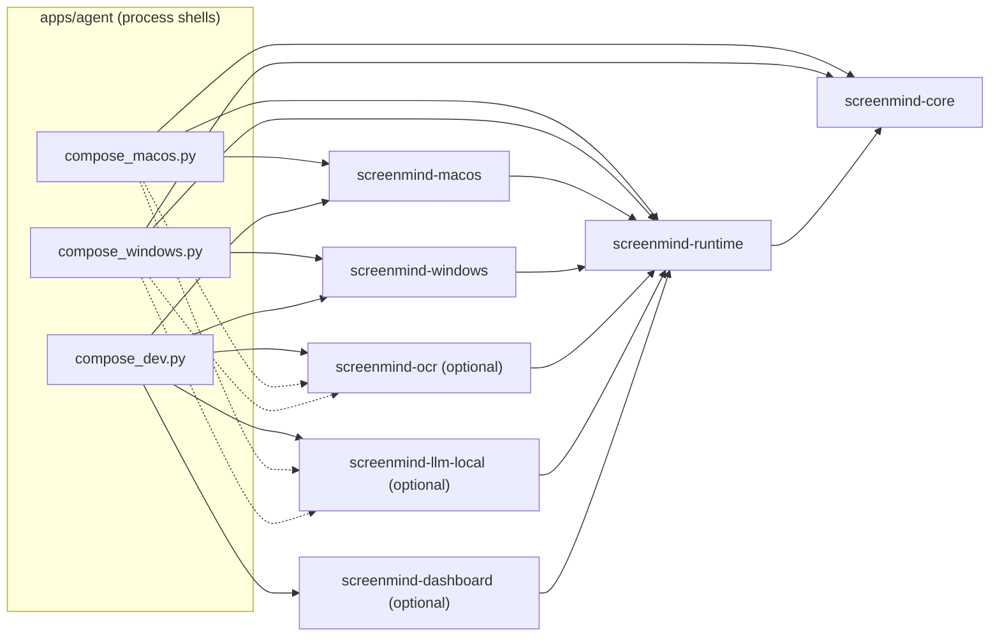

# Clean architecture and per-OS builds

Status: plan only, 2026-10-08. No code is changed. Written from ScreenMind `origin/custom` at `c879a74` (after the packaging fixes F1-F5, the Windows installer, daily retention and the Windows tray) and from backend-monorepo `origin/main` (read-only; that repo has no `custom` branch).

## Short answer

- **Target:** one bounded context ("activity capture") with a pure core (domain, use cases, ports) and adapters in separate uv workspace packages: `screenmind-core`, `screenmind-runtime` (SQLite, settings, images), `screenmind-macos`, `screenmind-windows`, `screenmind-ocr`, `screenmind-llm-local`, `screenmind-dashboard`. Each build has its own composition root and installs only what it needs.
- **What the split buys.** Third-party OS deps are already kept apart by `sys_platform` markers: a Mac install never gets `uiautomation`, and Windows never gets pyobjc. So the per-OS split mostly makes the code clean and testable. The big size and RAM gains come from making OCR, local Gemma, the dashboard and scipy optional: 343 MB → about 100-130 MB on macOS for a capture-only agent.
- **Home:** a split. Keep the desktop agent in its own repo, built to the monorepo's Python rules so it can move in later. Put the ingest side into backend-monorepo, as a module of `services/workflows` or as a new content type in Evolve Coach intake. The monorepo CI has only Linux runners and one shared lock, and PyInstaller can't cross-compile, so the agent can't be built or tested there today.
- **First three steps:** (1) add an import-linter ratchet and a macOS CI job; (2) move the SQL and FastAPI leaks behind `Database` and the API (`db._get_conn()` in routes, `serve_image` in `privacy/`); (3) make one place pick the OS (a `Platform` bundle) and remove `sys.platform` branches outside the adapters.

## 1. Monorepo rules that apply

Read from `/Users/pavel/projects/backend-monorepo` at `origin/main` (the local checkout is 25 commits behind, so files were read with `git show origin/main:<path>`).

| Rule | Where | Fits ScreenMind? |
|---|---|---|
| "Codified conventions win" over nearby code | `AGENTS.md:7-9` | Yes |
| One monorepo for everything, apps and infra, one CI | `docs/strategies/internal-developer-platform.md:18-20` | Against a separate repo. See section 6. |
| Python `==3.14.*` | `pyproject.toml:5` | Yes. ScreenMind already needs 3.14 (`.python-version`, `pyproject.toml` `requires-python = ">=3.14"`). |
| One uv workspace, one root `uv.lock`, members listed by path | `pyproject.toml:11-21` | Possible. pyobjc and `uiautomation` already carry `sys_platform` markers. The lock must also resolve for darwin arm64 and win AMD64 (ScreenMind's `[tool.uv] required-environments`). |
| New package versions wait 2 weeks | `pyproject.toml:7-9` (`exclude-newer = "2 week"`) | Yes, but it slows pyobjc and onnxruntime fixes. |
| Exact pins, one version per package across members | `services/workflows/pyproject.toml` (`fastapi==0.137.2`, `pydantic==2.13.4`, `dishka==1.10.1`) | ScreenMind uses ranges and `fastapi 0.115.6`. The dashboard would need the newer FastAPI. |
| Ruff per service: `py314`, line 128, rules `E,W,F,I,N,B,TID,ANN,INP,T,DTZ,PIE,S` | `services/workflows/ruff.toml` | Yes. ScreenMind lints only `T201` today (`.github/workflows/ci.yml`). `ANN` and `DTZ` will need work. |
| Pyright, no mypy | `[tool.pyright]` in each service `pyproject.toml` | Yes. Pyobjc has few stubs, so adapters need `# pyright: ignore` or a looser profile. |
| Import contracts with import-linter, per service | `services/workflows/.importlinter` (contracts `domain_independent`, `infrastructure_no_application`, `no_module_cycles`...). Changes need a named approver (`CODEOWNERS:24-26`). | Yes. This is the main tool for the per-OS boundary. |
| Four layers: domain, application, infrastructure, presentation. Domain imports nothing. Infrastructure imports only `application.interfaces`. | `services/x/ARCHITECTURE.md:154-185` | Yes. |
| One door per package: `__init__.py` with `__all__` | `services/x/ARCHITECTURE.md:180-185` | Yes. |
| Use case names `<Context><Action>UseCase` | `services/x/ARCHITECTURE.md:289-303` | Yes. |
| An `InMemory` version next to every interface | `services/x/ARCHITECTURE.md:339-344` | Yes, and it helps: tests can run the core on Linux CI with fake OS adapters. |
| Dishka container, `Scope.APP` / `Scope.REQUEST` | `services/x/ARCHITECTURE.md:350-360`, `services/workflows/src/workflows_composition/containers.py` | Optional. A plain composition function is lighter. Swap to Dishka only if the code moves in. |
| Layout `src/bc/<context>/<module>/{domain,application,infrastructure,presentation}`, process shells per entry point | `services/workflows/AGENTS.md:5-7`, `services/workflows/src/` | Partly. Per-OS packages need infrastructure in other distributions (section 4). |
| "Split by responsibility and domain ... Never group by technical kind." | `docs/code-style.md` | ScreenMind groups by kind today (`capture/`, `engine/`, `workers/`, `storage/`). |
| Tests next to code as `*_test.py`, `integration` marker, skipped without `--run-integration` | `services/workflows/.pytest.ini:3`, `services/workflows/conftest.py:4-13` | Later. Moving 40 test files is churn with no gain until the move. |
| Per-service `Makefile`: `install`, `lint_check`, `test_with_coverage` | `services/workflows/Makefile:14-55` | Yes. |
| Per-service CI child pipeline on Linux k8s runners, image `python:3.14.7-uv` | `services/workflows/.gitlab-ci-trigger.yml`, `.gitlab-ci/python.yml:18,50`, `.gitlab-ci/defaults.yml:2-3` | Only for the core. No macOS or Windows runners exist, so adapters and PyInstaller builds can't run there. |
| Dockerfile, Kaniko to ECR, Trivy, ArgoCD deploy | `services/workflows/Dockerfile`, `.gitlab-ci/deploy-and-build.yml:135-158` | No: it is a desktop app. Precedent for artifacts without an image: `evolve-coach/projects/cli/.gitlab-ci.yml` (binaries + manifest to S3) and `services/mwaa`. |
| Commit message starts with a ticket id or `TRIVIAL:`; Husky hooks need pnpm | `libs/lint-commit-message/README.md`, `.husky/pre-commit`, `.husky/commit-msg`, `AGENTS.md:12-13` | Yes if moved. |
| C4 diagram entry | `services/architecture/diagrams/6-workflows-on-premises/workspace.dsl` (add a system with `make create`) | Yes, for the ingest side. |
| Intake contract: batch of 1-500 events, stable `id` per event, per-event result `accepted / duplicate / quarantined`, identity only from the JWT, additive changes, "never an inference" | `evolve-coach/contracts/README.md:7,19-32`, `evolve-coach/contracts/src/chat-event.ts:74-118`, `evolve-coach/ARCHITECTURE.md:7` | The shape fits a ScreenMind feed. Raw facts (app, title, URL, UI events, call times) fit "never an inference". Gemma labels don't. |

Rules ScreenMind can't follow, and why:

- **Image, k8s, ArgoCD.** It runs on the user's laptop. Ship a signed app instead, like the coach CLI ships binaries.
- **Postgres, goose, `@with_organization`, a permission check per use case** (`services/x/ARCHITECTURE.md:311-315, 436-441`). It is single-user with local SQLite. There is no tenant or actor on the device.
- **Full telemetry (OTel, Prometheus, Sentry at each entry point).** It breaks the lowest-resource rule (`CLAUDE.md`). Keep the rotating log file and the 10-minute summary line.
- **Linux-only CI.** The adapters need macOS and Windows runners.

## 2. Current state

### Layer map

| Layer | Module today | Notes |
|---|---|---|
| Domain (pure already) | `privacy/data_filter.py`, `privacy/url_filter.py`, `capture/ui_events/models.py`, `capture/ui_events/text_buffer.py`, `workers/call_detection.py`, `export/sessions.py` | Stdlib only. Good starting point. |
| Domain (hidden in workers) | `workers/analysis_worker.py` `_a11y_is_content` (101), `_screen_text_len` (83), `_extract_url` / `_extract_all_urls` (138, 148), `_CHROME_MARKERS`, `_MENU_WORDS`; `workers/capture_worker.py` `filter_sensitive` (463) | Rules about frames, mixed into loops. |
| Domain model | `storage/models.py` `ScreenshotEntry`, `ActivityRecord` | `ActivityRecord` is pydantic and is also the Gemma output schema. |
| Application (use cases) | `CaptureWorker._capture_tick` / `_capture_monitor` / `_link_ui_events`, `AnalysisWorker._process` (282-636, 355 lines) and `_backfill_skipped`, `AudioWorker.update`, `UiEventRecorder`, `workers/retention.py` `Retention` (over `Database.cleanup_old_data`), `export/archive.py` `write_export` | Each mixes OS calls, settings, SQL and loop control. |
| Ports (exist) | `platform_support/base.py` `PlatformAdapter`, `capture/ui_events/base.py` `UiEventBackend` | Real interfaces already. The adapters behind them are clean per OS. |
| Infrastructure, per OS | `platform_support/macos.py`, `macos_audio.py`, `windows.py`, `win_tray.py` (Shell_NotifyIconW through ctypes), `linux.py`; `capture/sck.py`, `capture/wayland.py`; `capture/ui_events/macos.py`, `windows.py`; `startup.py`, `launcher.py` | |
| Infrastructure, shared | `storage/database.py` (SQLite, 13 migrations), `capture/screen.py` (grab + monitor pick), `capture/dedup.py` (imagehash), `engine/ocr.py` (RapidOCR), `engine/llm_client.py` + `analyzer.py` + `layout_analyzer.py` (Gemma), `engine/model_manager.py` + `setup_llama.py` (llama-server), `privacy/encryption.py`, `config.py` | |
| Presentation | `api/server.py`, `api/routes/*`, `api/static/` (184 KB), `tray.py` (`TrayController`: menu and status text, no OS calls), `capture/ui_events/__main__.py`, `main.py`, `watchdog.py`, `packaging/entry.py` | `TrayController` is already split the right way: an OS-free controller plus a Win32 backend. |

### Main problems

1. **Global settings everywhere.** 23 modules import `from screenmind.config import settings` (the new `workers/retention.py` too). Top users by `settings.` references: `main.py` 32, `engine/model_manager.py` 31, `workers/capture_worker.py` 14, `capture/ui_events/recorder.py` 9, `workers/audio_worker.py` 8. No rule can run or be tested without `config.py`, pydantic-settings and `.env` loading.
2. **OS branches outside the adapters.** 38 `sys.platform` checks in 11 files. The ones that should move: `capture/screen.py:82,92,111,183,185,342` (grab chain and monitor pick), `capture/ui_events/recorder.py:69,76` (`create_backend`), `workers/analysis_worker.py:59` (`_A11Y_TYPE_FILTERED`), `privacy/encryption.py:82`, `api/routes/settings.py:93`, plus `main.py` (7, including the tray at `main.py:301`), `startup.py` (7), `setup_llama.py` (4), `launcher.py` (4), `engine/model_manager.py` (3). F1-F4 added a second axis, "frozen app or source" (`config.is_frozen()`, `sys.frozen`), now read in `config.py`, `main.py`, `startup.py`, `launcher.py`, `setup_llama.py` and `engine/model_manager.py`. The tray default follows it too (`Settings.tray_icon_on`).
3. **SQL outside storage.** `db._get_conn()` in `api/routes/timeline.py:53,77`, `api/routes/search.py:21`, `workers/analysis_worker.py:216,293,646`, `export/archive.py:117,159,189`. `main.py:230` opens its own `sqlite3` connection for the WAL checkpoint.
4. **Framework in the wrong layer.** `privacy/encryption.py` `serve_image` imports FastAPI. `api/routes/timeline.py:104` imports the private `_extract_all_urls` from `analysis_worker`. The re-analyze route (`timeline.py:90-140`) builds its own `GemmaAnalyzer` and runs OCR layout and Gemma itself, on its own `DaemonExecutor` (`timeline.py:17`), instead of calling the same analysis use case as `AnalysisWorker`. `engine/analyzer.py:28` reads the OS adapter (`trusts_os_app_name`) inside labeling.
5. **Wiring by mutation.** `main.py:212` sets `capture_worker._ui_recorder`. `main.py:222,256` set globals in `api/dependencies.py`. `main.py:301-304` starts the tray with the capture worker and `request_shutdown` passed in. `platform_support.adapter()` is a lazy singleton, imported in 10 places outside `platform_support`.
6. **Every optional part is a hard dependency.** `pyproject.toml` lists `rapidocr`, `onnxruntime`, `huggingface_hub`, `sounddevice`, `fastapi`, `uvicorn`, `cryptography` and `keyring` as core deps. `main.py:18,26` import uvicorn and the API at the top. `workers/analysis_worker.py:34-36` import OCR and `model_manager` at the top. No build can leave out OCR, Gemma or the dashboard without code changes.
7. **The build takes all code.** `packaging/screenmind.spec` uses `collect_submodules("screenmind")`. The Mac app gets `windows.py`, `linux.py` and `wayland.py`, and the Windows app gets `macos.py` and `sck.py`. These are small (about 100 KB of source), but it shows nothing enforces the split.
8. **`main.py` does too much.** It installs and starts llama-server, starts the retention task, checks the port for a single instance, runs uvicorn in a thread, handles signals and the shutdown deadline, starts the Windows tray, and wires everything.
9. **Weak checks.** CI runs tests on `windows-latest` only (`.github/workflows/ci.yml`). macOS code is tested through fakes (`db6a627`). No import contracts, no type check.

What is already good: the two ports (`PlatformAdapter`, `UiEventBackend`), per-OS adapter files, pure privacy and call-detection rules, lazy imports of pyobjc and `uiautomation`, and markers that keep third-party OS deps out of the other OS.

### Heavy deps and where they come from

From `uv.lock` and the main `.venv` (sizes are installed sizes on macOS; bundle sizes are in the table in section 5):

| Package | Pulled in by | Installed | Bundle macOS / Windows | RAM |
|---|---|---|---|---|
| `onnxruntime` | direct (OCR) | 76 MB | 70 / 36 MB | part of OCR's 1.1-1.8 GB (macOS) / 450 MB (Windows) |
| `cv2` (`opencv-python`) | **only `rapidocr`** | 120 MB | about 118 (with ffmpeg/X11 libs) / 112 MB | about 35 MB on import |
| `shapely`, `pyclipper`, `omegaconf` | only `rapidocr` | 7 MB + small | small | with cv2: importing `RapidOCR` takes RSS from 19 to 81 MB |
| `rapidocr` | direct | 32 MB (31 MB are default models we never use, F6) | about 30 / 30 MB | |
| `scipy` + `pywavelets` | **only `imagehash`** | 73 + 9 MB | 32 / 46 + 19 (`scipy.libs`) MB | +28 MB on the first `phash()` call |
| `huggingface_hub` + `hf_xet` | direct (Gemma download) | 5 + 9 MB | about 14 MB | |
| `fastapi`, `starlette`, `uvicorn[standard]` (uvloop, httptools, watchfiles, websockets) | direct (dashboard) | about 15 MB | about 15 MB | about 30 MB on import, with pydantic |
| `cryptography`, `keyring` | direct (encryption) | 21 MB | about 20 MB | `keyring` import takes 1.3 s |
| `sounddevice` | direct (call transcription) | small + PortAudio | small | |
| pyobjc (Cocoa, Quartz, ApplicationServices, ScreenCaptureKit) | direct, darwin only | about 20 MB | about 20 / 0 MB | about 38 MB on import |
| `uiautomation` + `comtypes` | direct, win32 only | | 0 / a few MB | |

RAM numbers are import-time maxrss in a fresh `python -B -I` from the main `.venv` (Python alone: 18 MB). OCR numbers are from [packaging.md, Resource budget](../packaging.md#resource-budget).

## 3. Target structure

### Packages

A uv workspace. Import names are unique (`screenmind_core`, not `src`), because several distributions and PyInstaller both need distinct top-level names.

```
packages/
  core/          screenmind-core         domain + application + ports. Stdlib only.
  runtime/       screenmind-runtime      SQLite repos, settings, image store, pHash, export writer, loops, watchdog.
                                          Deps: core, Pillow, numpy, pydantic-settings, mss.
  macos/         screenmind-macos        PlatformAdapter, SCK grabber, CGEventTap backend, CoreAudio mic,
                                          login item, menu bar. Deps: runtime, pyobjc-* (darwin markers).
  windows/       screenmind-windows      Win32/UIA adapter, mss grabber, LL hooks, clipboard, Run key, tray.
                                          Deps: runtime, uiautomation (win32 markers).
  linux/         screenmind-linux        Dev only, never shipped (open question 4).
  ocr/           screenmind-ocr          TextRecognizer on RapidOCR + onnxruntime, run in a short-lived worker process.
  llm-local/     screenmind-llm-local    FrameLabeler + Transcriber on llama-server; model_manager, setup_llama.
                                          Deps: core, httpx, huggingface_hub.
  calls-audio/   screenmind-calls-audio  Call recording with sounddevice. Needs a Transcriber.
  dashboard/     screenmind-dashboard    FastAPI routes + static. Deps: runtime, fastapi, uvicorn.
  feed/          screenmind-feed         Later: FeedSink that posts batches to the ingest endpoint. Deps: core, httpx.
apps/
  agent/         screenmind-agent        Composition roots and process shells: compose_macos.py, compose_windows.py,
                                          compose_dev.py. Deps: core, runtime,
                                          screenmind-macos ; sys_platform == 'darwin',
                                          screenmind-windows ; sys_platform == 'win32'.
                                          Extras: [ocr], [llm-local], [calls-audio], [dashboard], [feed].
```

The status UI is one port with an OS-free controller: `TrayController` (`tray.py`) moves to `runtime`, and each OS package brings its backend: `win_tray.py` in `screenmind-windows`, a later `NSStatusItem` menu bar item in `screenmind-macos`.

Encryption (`cryptography`, `keyring`) stays in `runtime` for now (open question 6).

### Layers inside `screenmind-core`

One bounded context, `activity_capture`, with modules by responsibility, as `docs/code-style.md` asks:

```
screenmind_core/
  frames/       domain: Frame, Activity, AppIdentity (app_key), A11yQuality (_a11y_is_content), dedup policy
                application: CaptureFramesUseCase, LinkUiEventsUseCase, AnalyzeFrameUseCase, BackfillUseCase
  ui_events/    domain: UiEvent, EventType, TextBuffer, describe_event
                application: RecordUiEventsUseCase
  calls/        domain: CallMatch, match_call, same_call
                application: TrackCallsUseCase
  privacy/      domain: data_filter, url_filter (shared kernel, used by every module)
  retention/    application: ApplyRetentionUseCase (today `workers/retention.py` `Retention`; its hourly loop becomes presentation)
  export/       domain: Session, IdleGapSplitter
                application: BuildExportUseCase
  interfaces/   the ports below, each with an InMemory version for tests
```

This differs from the monorepo layout on purpose. There, a module folder holds all four layers. Here, infrastructure lives in other distributions, because the point is to leave whole OS or feature packages out of a build. The import contracts still follow the monorepo's rules.

### Ports

| Port | Today | macOS adapter | Windows adapter | Optional? |
|---|---|---|---|---|
| `ScreenGrabber` (displays, grab) | `capture/screen.py` `ScreenCapture` | SCK → `screencapture` → mss | mss | no |
| `WindowInspector` (front window, top window in a rect, visible windows, URLs, `trusts_os_app_name`) | `PlatformAdapter` | Quartz + AX | EnumWindows + UIA | no |
| `AccessibilityReader` | `PlatformAdapter.extract_a11y_text` | AX | UIA | no |
| `UiEventSource` | `UiEventBackend` | CGEventTap + AX + NSPasteboard | LL hooks + UIA + clipboard | yes (setting) |
| `MicUsage` | `PlatformAdapter.mic_apps` | CoreAudio | none yet | yes |
| `LoginItem` | `startup.py` | LaunchAgent, later `SMAppService` | HKCU Run | no |
| `ProcessSignals` (quit, shutdown) | `main.py`, `routes/settings.py:93`, `packaging/entry.py` `_watch_quit_event` (installer quit event, `25de57a`) | SIGTERM | named event / CTRL_C | no |
| `TextRecognizer` | `engine/ocr.py` | `screenmind-ocr` | `screenmind-ocr` | yes, Null = no OCR |
| `FrameLabeler` | `engine/analyzer.py` + `llm_client.py` | `screenmind-llm-local`, later a server or vendor adapter | same | yes, Null = no labels |
| `Transcriber` | `llm_client.transcribe_audio` | `screenmind-llm-local` | same | yes |
| `ActivityRepository`, `UiEventRepository`, `MeetingRepository` | `storage/database.py` | `runtime` (SQLite) | same | no |
| `ImageStore` (save, open, delete, encrypt) | `capture/screen.py`, `privacy/encryption.py` | `runtime` | same | no |
| `ExportSink` / `FeedSink` | `export/archive.py` | zip writer in `runtime`; HTTP in `screenmind-feed` | same | feed yes |
| `StatusIcon` (show status, pause/resume, quit) | `tray.py` `start_tray` → `platform_support/win_tray.py` `Win32Tray` | `NSStatusItem`. Needs the AppKit run loop on the main thread, so the macOS shell runs asyncio on a worker thread (packaging M1, not built) | `Win32Tray` (Shell_NotifyIconW, +0.5 MB, +1 thread) | yes (`tray_icon`) |
| `PowerState` (AC, idle, thermal) | none | IOKit | GetSystemPowerStatus | later, for scheduling |

Config: each use case and adapter takes a small typed config (`CaptureConfig`, `AnalysisConfig`...). Only `runtime` reads `settings.json` and `.env`.

### Composition root per build



- Each `compose_*.py` imports its adapters by name. Static imports, not entry points: PyInstaller follows them, and a missing package fails loudly at build time.
- An optional part is wired only if its package is installed (`importlib.util.find_spec("screenmind_ocr")`). Otherwise the root passes the Null adapter.
- A build is one venv: `uv sync --frozen --no-dev --package screenmind-agent --extra ocr`. PyInstaller then bundles only what is installed and imported.
- The spec lists what must never be there, as a second guard: `excludes=["screenmind_windows", "uiautomation", "comtypes", "fastapi", ...]` per build.

### Boundary checks

1. **import-linter** (`.importlinter` at the root, the monorepo's contract types):
   - `core_is_pure`: `screenmind_core` imports no other `screenmind_*` and no third-party package (forbidden contract: `objc`, `AppKit`, `Quartz`, `ScreenCaptureKit`, `uiautomation`, `comtypes`, `sqlite3`, `httpx`, `fastapi`, `PIL`, `numpy`, `onnxruntime`, `rapidocr`).
   - `layers`: `presentation > application > domain` inside each core module; `application.interfaces` is the only door for adapters.
   - `os_independent`: `screenmind_macos` and `screenmind_windows` don't import each other; `runtime` imports neither.
   - `features_independent`: `ocr`, `llm_local`, `dashboard`, `feed` don't import each other or any OS package.
   - `composition_only`: only `screenmind_agent` imports OS and feature packages.
2. **Dependency check:** a test that reads each member's `pyproject.toml` and fails if `screenmind-core` declares any dependency, or if an OS package lacks its marker.
3. **Bundle check** after each PyInstaller build: list the bundled modules and files, fail on a forbidden name, and write the size per top-level package to the build log. Fail on more than 10% growth against the last tagged build.
4. **Type check:** pyright on `core` and `runtime` in strict mode, basic mode for adapters (pyobjc has few stubs).

## 4. Where the code lives: new repo, monorepo service, or split

| | New GitLab repo | Monorepo service | Split (recommended) |
|---|---|---|---|
| Agent code | own repo, own lock | `services/screenmind/` with `packages/*` as root workspace members | own repo, built to monorepo rules |
| Ingest side | in the agent repo (no server) or a separate service | a module next to the agent | `services/workflows` module (`src/bc/workflows/activity_feed/`) or a new content type in `evolve-coach/contracts` |
| CI | GitHub Actions or GitLab with macOS + Windows runners | Linux k8s runners only (`.gitlab-ci/python.yml`). Needs new macOS and Windows runners for adapter tests and builds. | agent: macOS + Windows runners; ingest: existing monorepo CI |
| Lock | own; pyobjc and onnxruntime bumps are local | shared root `uv.lock`, exact pins, 2-week delay; a pyobjc bump is a monorepo-wide lock change with reviewers | agent own, ingest shared |
| Releases | signed app per tag, as in [packaging.md](../packaging.md) | like `evolve-coach/projects/cli`: artifacts and a manifest to S3, no image | agent: signed app; ingest: normal image deploy |
| Conventions | copy ruff, pyright, import-linter configs | enforced by review and CODEOWNERS | agent copies them; ingest gets them for free |
| Strategy doc | goes against "one monorepo for everything" | follows it | partly; the contract and the server side live in the monorepo |
| Moving later | `git subtree add` into `services/screenmind/`, add members to the root workspace, switch CI | n/a | same as the new repo |

Why the split: the agent's hard parts (pyobjc, UIA, PyInstaller, signing) need macOS and Windows machines that the monorepo CI doesn't have. Its lock would also tie desktop-only bumps to server reviewers. The server side, the contract and the consumer (workflows mapper, `services/workflows/src/bc/workflows/agent/application/ai_session_agent_wip/`) belong with the monorepo.

What differs if the agent moves into the monorepo later:

- Members join the root `pyproject.toml` workspace list. The root lock must keep resolving for darwin arm64 and win AMD64.
- Pins become exact, and the dashboard must use the monorepo's FastAPI and pydantic versions.
- `ruff.toml`, `[tool.pyright]`, `.importlinter`, `Makefile`, `AGENTS.md`, `.gitlab-ci.yml`, `.gitlab-ci-trigger.yml` and a `CODEOWNERS` entry per the workflows service.
- Composition can switch to Dishka. Tests can move next to code as `*_test.py`.
- Commits need ticket ids. The repo's own GitHub Actions jobs move to GitLab macOS and Windows runners.
- Nothing in the layering changes. That is the point of following the rules now.

### The ingest contract

If the feed goes through Evolve Coach intake, copy its shape: batches of at most 500 events, a stable event `id` minted on the device (for example a hash of table, row id and data dir id), per-event results, and user identity only from the JWT. Add a new content type such as `screen_activity` in `evolve-coach/contracts`, holding facts only (app, title, sanitized URL, a11y/OCR text after redaction, UI events, call times). Gemma labels are inferences, so they can't go in that contract. Label on the server instead (option D in [packaging.md](../packaging.md#should-local-llm-analysis-ship)). The contract is TypeScript (typebox), so the agent needs a Python mirror and a contract test against a JSON sample.

## 5. Builds: what each one contains

Base numbers: today's spikes, 343 MB on macOS and 394 MB on Windows ([packaging-spikes.md](../packaging-spikes.md)). The other numbers are estimates from the package sizes above. Step 15 measures them.

| Build | Contains | macOS size | Windows size | Memory (agent) |
|---|---|---|---|---|
| Dev (today) | everything, all OS code | 343 MB | 394 MB | 123 MB after start (macOS); OCR adds 1.1-1.8 GB (macOS) / about 400 MB (Windows); llama-server 0.8-4 GB |
| **Agent, capture only** (default once labels move to the server) | core, runtime, OS package, numpy pHash, export / feed. No OCR, no Gemma, no dashboard, no other OS code. | about 100-130 MB | about 110-150 MB | about 80-100 MB (start 123 MB, minus FastAPI/uvicorn about 30 MB, minus scipy 28 MB) |
| Agent + OCR | above + `screenmind-ocr` (onnxruntime, rapidocr with our 5 models, cv2) | about 300 MB; about 230 MB with `opencv-python-headless` if it works | about 300 MB | as above when idle; the OCR worker process adds its 0.4-1.8 GB only while it runs a batch |
| Agent + OCR + local labeling (opt-in) | above + `screenmind-llm-local`, pinned `llama-server` (11 MB macOS, 31 MB Vulkan on Windows), models downloaded on demand (3.2 GB, or under 1 GB for a small text model) | about 330 MB | about 345 MB | + llama-server 0.8-4 GB while a batch runs, 0 when idle (`--sleep-idle-seconds`) |
| + call transcription | `screenmind-calls-audio` (sounddevice, PortAudio). Needs local labeling or a server transcriber. | + a few MB | + a few MB | small |
| + dashboard (dev, support) | `screenmind-dashboard` | + about 15 MB | + about 15 MB | + about 30 MB |

Where the size goes, in order: OCR (about 185-225 MB), scipy (32-65 MB, replaced by about 15 lines of numpy), huggingface_hub + hf_xet (about 14 MB), the dashboard (about 15 MB). The per-OS code split itself saves well under 1 MB.

## 6. Steps

Each step ships alone, keeps both OS working and passes `uv run pytest tests -q`. Verification on both machines means `scripts/e2e_collect.py` on the Mac and on the Windows laptop, with `docs/status/<os>.md` unchanged or better. **No step changes the DB schema** (EDA sessions read the DB; migrations stay out of this refactor).

Work going on now that these steps must not collide with:

- **PII filtering** (worktree `exciting-volhard-f530d7`, uncommitted): `privacy/data_filter.py`, `config.py`, `export/archive.py`, `api/static/js/settings.js`.
- **Analysis work** (worktree `beautiful-matsumoto-ba1e24`, `wip` commit): `workers/analysis_worker.py`.
- **Packaging**: F1-F5 (`34ae529`), the NSIS installer (`25de57a`) and the Windows tray (`df0a25b`) are merged. The macOS packaging session works next on: agent mode (keep or drop FastAPI/uvicorn), the macOS menu bar (AppKit run loop on the main thread), the login item (`startup.py`), the desktop shortcut (`main.py` `_install_desktop_shortcut`) and an OCR worker process. These touch `config.py`, `startup.py`, `main.py`, `engine/ocr.py` and `packaging/*`.
  - **Rule:** packaging fixes behavior first. This refactor then moves that code without changing what it does. Steps 5, 8, 9, 10 and 16 start only after asking the macOS packaging session what is open in those files.
- **Shutdown and retention fixes**: merged (`f351ba2` daily retention in `workers/retention.py`, G24; `b5e0d2a` re-analysis on a `DaemonExecutor`). Check with that session before touching `main.py` shutdown order, `watchdog.py` or `workers/retention.py`.
- **EDA on the data**: reads `~/.screenmind`. Safe as long as the schema and the export format stay.

| # | Step | Goal | Files | Risk | Verify | Waits for |
|---|---|---|---|---|---|---|
| 1 | Import-linter ratchet | Contracts for the target layering of today's `screenmind` package. Today's violations go into `ignore_imports`, so only new ones fail. Run with `uv run --with import-linter lint-imports`, so no lock change. | `.importlinter`, `.github/workflows/ci.yml` | low | CI green; a test import of `fastapi` from `privacy/` fails | nothing |
| 2 | macOS CI job | Run the tests on `macos-15` too, not only `windows-latest`. | `.github/workflows/ci.yml` | low; some tests may assume Windows | both jobs green | nothing |
| 3 | FastAPI out of `privacy/` | Move `serve_image` from `privacy/encryption.py` to `api/` (next to `routes/screenshots.py`). | `privacy/encryption.py`, `api/routes/screenshots.py` | low | `test_encryption`, `test_api_routes` | nothing |
| 4a | SQL out of routes | `Database` methods for what `routes/timeline.py:53,77` and `routes/search.py:21` do by hand. | `api/routes/timeline.py`, `api/routes/search.py`, `storage/database.py` (new methods only) | low | `test_api_routes`, search in the dashboard | nothing |
| 5 | One place picks the OS | `platform_support.create_platform()` returns a `Platform` bundle (window inspector, a11y reader, grabber, UI event backend, mic, login item, signals). Move `recorder.create_backend` (69, 76), `_A11Y_TYPE_FILTERED` (`analysis_worker.py:59`, becomes an adapter property), `encryption.py:82`, `routes/settings.py:93` and the tray pick (`main.py:301`, the bundle gets a `status_icon` that is `None` where none exists) into it. Keep `adapter()` as a shim. | `platform_support/*`, `capture/ui_events/recorder.py`, `privacy/encryption.py`, `api/routes/settings.py`, `main.py` (tray lines only); one line in `analysis_worker.py` | medium | `test_ui_events*`, `test_windows_adapter`, `test_macos_frontmost`, `test_tray`; e2e on both machines | the analysis `wip` for the one-line change (or leave that line for step 9) |
| 6 | Grabber per OS | Split `capture/screen.py` into a `ScreenGrabber` port, `MacGrabber` (SCK → `screencapture` → mss, slow-grab rule at 342), `MssGrabber` (Windows monitor pick at 111, 137) and `WaylandGrabber`. Monitor selection becomes a pure function. | `capture/screen.py`, `capture/sck.py`, `capture/wayland.py`, `workers/capture_worker.py` (constructor only) | medium: the capture path | `test_capture`, `scripts/sck-bench.py`, e2e on both | step 5 |
| 7 | Pure rules into a domain package | New `screenmind/domain/`: `filter_sensitive` (from `capture_worker.py:463`), `app_key`, `call_detection`, `text_buffer`, `ui_events/models`, `export/sessions`. Old paths re-export. | listed modules, shims | low | all tests; import-linter `domain_independent` | `privacy/*` and `export/*` wait for the PII session; `_a11y_is_content` and URL helpers wait for the analysis `wip` |
| 8 | Composition root | `screenmind/composition.py` builds the DB, the platform, the workers, the recorder and the API with constructor arguments. The process shell owns the main thread: on macOS the menu bar needs the AppKit run loop there, so asyncio may run on a worker thread. So `composition.py` must not assume it owns the main thread, and signal handlers are set by the shell (`signal.signal` works only on the main thread). Remove `capture_worker._ui_recorder =` (`main.py:212`). `Retention` gets its config from the root instead of `settings` and the `api/dependencies.py` globals (use `app.state`). `main.py` keeps only process start and stop. | `main.py`, `api/dependencies.py`, `api/server.py`, `workers/*` constructors, `packaging/entry.py` (it calls `dependencies.request_shutdown`) | medium | `test_shutdown_route`, `test_uptime`, `test_frozen_app`, the retention tests; e2e; a stop within the shutdown deadline; the installer stop (`packaging/windows/stop-screenmind.ps1`) | packaging M0 agent-mode changes in `main.py` |
| 4b | SQL out of the workers and the export | Repository methods for `analysis_worker.py:216,293,646` and `export/archive.py:117,159,189`; `Database.checkpoint_wal()` for `main.py:230`. | same | low | `test_workers`, `test_export`, `test_analysis_shutdown` | analysis `wip`, PII session |
| 9 | Optional OCR and labels | `AnalysisWorker` takes `ocr: TextRecognizer \| None` and `labeler: FrameLabeler \| None`. Move the top imports at `analysis_worker.py:34-36` and `main.py:18,26` behind the composition root. The re-analyze route calls the same `AnalyzeFrameUseCase` as the worker (on its `DaemonExecutor`), instead of its own copy of the pipeline. The app starts and captures with `rapidocr`, `onnxruntime`, `fastapi` or `httpx` missing. | `workers/analysis_worker.py`, `api/routes/timeline.py`, `engine/*`, `main.py`, `composition.py` | medium | new test: run the composition with the optional packages hidden (`sys.modules` blocked) | step 8; open question 3 (row status without labels) |
| 10 | Config objects | Typed configs per use case and adapter, built in the composition root. Start with leaf modules: `engine/ocr.py`, `engine/llm_client.py`, `capture/ui_events/recorder.py`, `workers/audio_worker.py`, then `capture_worker.py`. `model_manager.py` last. | one module per PR | medium: many small changes | `test_config` and the module's tests | `config.py` changes from the PII session |
| 11 | Bundle check | `scripts/check_bundle.py`: reads PyInstaller's analysis output, prints size per top-level package, fails on forbidden modules per OS. Warn-only at first. | `scripts/check_bundle.py`, the build workflows | low | run on both spike builds and the installer CI build | nothing (installer merged) |
| 12 | numpy pHash | Replace `imagehash` (drops scipy and pywavelets). Same hashes. | `capture/dedup.py`, `workers/analysis_worker.py:696`, `pyproject.toml`, `uv.lock` | low; lock change, so tell the user to `uv sync` the main `.venv` and restart | `test_phash_distances` identical | analysis `wip` (line 696) |
| 13 | uv workspace | Move code into `packages/*` and `apps/agent` with their own `pyproject.toml` and deps; root becomes a virtual workspace. New import names (`screenmind_core`...). A `screenmind` shim package keeps old imports for one release. | everything; `scripts/dev-instance.sh`, `packaging/screenmind.spec`, `bench/`, `tests/` | high: every open branch conflicts | full tests on both OS; dev instance; spike builds; e2e | a quiet day: announce it to all sessions first, merge all open branches before |
| 14 | Contracts in fail mode | Turn the step 1 ignores into zero and switch to the per-package contracts of section 3. Add pyright (strict on core and runtime). | `.importlinter`, `pyproject.toml` files, CI | low | CI | step 13 |
| 15 | Per-build roots and specs | `compose_macos.py`, `compose_windows.py`, `compose_dev.py`; one spec per build profile; CI matrix builds each, runs the bundle check in fail mode and records size and start memory. | `apps/agent/*`, `packaging/*`, workflows | medium | sizes in [packaging-spikes.md](../packaging-spikes.md) next to the estimates in section 5 | steps 11, 13; packaging M0 |
| 16 | OCR worker process | `screenmind-ocr` runs batches in a short-lived child process (packaging lever 2). | `packages/ocr`, `runtime` scheduler | medium | `packaging/ocr_mem_bench.py`; memory back to idle after a batch | step 15 |
| 17 | Feed | `FeedSink` port and an HTTP adapter for the chosen ingest endpoint. Facts only, stable ids, batches of at most 500. | `packages/feed`, `apps/agent` | medium | contract test against a JSON sample; dry run against a local server | open questions 1 and 2 |

Cheapest and most unblocking first: steps 1, 2, 3 and 4a cost under a day together and touch nothing in flight. Step 5 is the first real per-OS step. Steps 8 and 9 make OCR and Gemma optional, which is where the size and RAM gains start. Step 13 is the big move. Do it only after the in-package contracts hold for a while, so it is a pure file move.

## 7. Open questions

1. **Home.** Is the split right: agent in its own repo, ingest in backend-monorepo? If yes, which GitLab group for the agent, and does it stay on GitHub (`Venopacman/ScreenMind`) until then?
2. **Ingest endpoint.** A new content type in Evolve Coach intake (`POST /intake/chat-events`, facts only), or a new module in `services/workflows`?
3. **Rows without labels.** When no labeler is wired, what status should a frame get? `ok` with capture fields only, or a new status such as `collected`? The export ships only `status='ok'` rows today, so this decides what the feed sends.
4. **Linux.** Keep `linux.py` and `wayland.py` as a dev-only `screenmind-linux` package, or delete them?
5. **Export without the dashboard.** The shipped agent has no dashboard, but the export is an HTTP route (`GET /api/export`). Should the agent export through a menu item or CLI flag instead, or only through the feed?
6. **Encryption.** Keep `cryptography` and `keyring` (about 20 MB, 1.3 s to import `keyring`) in every build, or make screenshot encryption an optional package?
7. **Upstream.** This refactor moves almost every file. PRs to the original project (`ayushh0110/ScreenMind`) get much harder after step 13. Are we done sending fixes upstream?
8. **Monorepo conventions now or at the move?** Adopting the full ruff rule set (`ANN`, `DTZ`, `S`) and tests next to code now costs time with no user-visible gain. The proposal: import-linter and pyright now, the rest at the move.
